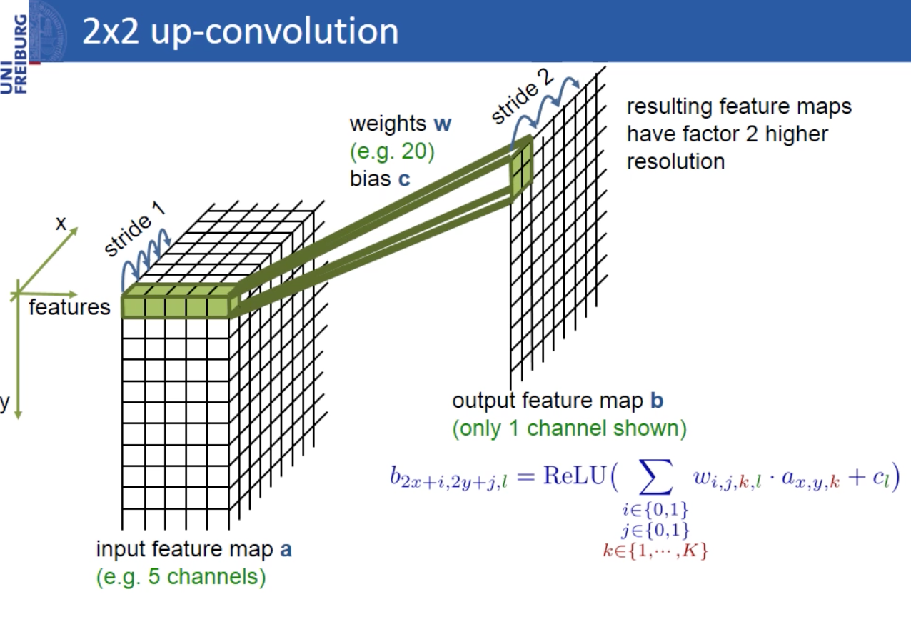

# Deep Learning Segmentation Structure
This document describes 3 structures selected for bio-image segmentation:
**AlexNet**, **U-Net**, **SegNet**.

## AlexNet
AlexNet is also called ImageNet / K-Net(paper: Deep Contour Segmentation)

### Structure
***
#### ReLU Nonlinearity
For sigmoid and tanh activation function, there are 2 disadvantages: vanishing gredient and exploding gradient problem. [More information](http://datascience.stackexchange.com/questions/15484/sigmoid-vs-relu-function-in-convnets)
#### Training on Multiple GPUs

#### Local Response Normalization
Although ReLUs can prevent data from saturating without requiring input normalization (For sigmoid and tanh, gradient is the highest at 0), the unbounded activation of ReLUs requires local response normalization. This conception comes from bio-conception: lateral inhibition. [More information](https://prateekvjoshi.com/2016/04/05/what-is-local-response-normalization-in-convolutional-neural-networks/)
#### Overlapping Pooling

#### Overall Architecture
`[image source] http://vision03.csail.mit.edu/cnn_art/`
### Reduce Overfitting
***
#### Data Augmentation
1. Image translations and horizontal reflections. 
	Translation: Crop 224 * 224 patches(and their horizontal reflections) from 256 * 256 images.
	At test time, the network makes a prediction by the same way to get 10 patches per image and averaging the predictions made by the network's softmax layer.
2. Altering the intensities of the RGB channels in training images by PCA (add multiples of the found principal components, with magnitudes propotional to the corresponding eigenvalues times a random variable drawn from a standard Gaussian).

#### Dropout
Set a node's output to zero with probabilty 0.5 while training. At test time, we use all nodes but multiply their outputs by 0.5.

## U-Net
### Architecture
***

`[image source] http://lmb.informatik.uni-freiburg.de/people/ronneber/u-net/`
### Upsampling
***

`[image source] http://lmb.informatik.uni-freiburg.de/people/ronneber/u-net/`

## SegNet

